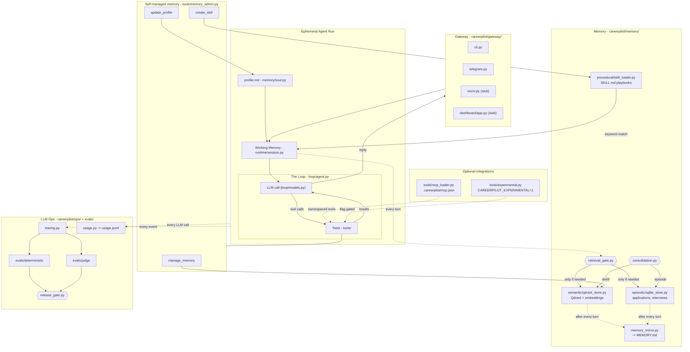

# CareerPilot architecture

## What's different from waku-agent, on purpose
- Semantic memory: Qdrant + real embeddings, not SQLite FTS5.
- Episodic memory: still SQLite, because applications/interviews are
  structured relational data, not free text needing similarity search.
- Domain: job-search co-pilot, not a general personal assistant.
- `auto_apply` and `draft_outreach_email` are experimental/disabled —
  auto-submitting applications or sending emails on your behalf is a
  real trust step that deserves a deliberate safety review, not a
  default-on tool.

## What's deliberately the same as waku-agent
- The loop shape (reason/act/observe, two guardrails) — `loop/agent.py`.
- The Observer pattern decoupling tracing/UI/usage-tracking from the loop.
- The retrieval gate before any memory query — `memory/retrieval_gate.py`.
- Deterministic + judge evals kept as two separate suites, gated together.
- Standing preferences in a plain, editable file (`profile.md`, waku's
  SOUL.md) — not buried in embeddings or code.
- A human-readable `MEMORY.md` mirror regenerated every turn, alongside
  the real queryable stores.
- An append-only `usage.jsonl` cost ledger that survives demo resets.
- Self-managed memory: the agent can `manage_memory` (forget/correct),
  `update_profile`, and `create_skill` — memory isn't read-only.
- MCP support: drop a `.careerpilot/mcp.json` and external tools show
  up namespaced (`mcp_<server>_<tool>`), same as waku.
- Multiple gateways (CLI, Telegram, voice, dashboard) all calling the
  exact same loop — "one brain, many doors."
- Roadmap features shipped as visible, flagged-off stubs
  (`tools/experimental.py`) rather than silently missing.

## Deliberately deferred (stubs, not full builds)
- `gateway/voice.py` — wake-word/STT/TTS is real infra, but adds no
  architectural learning until the core loop is solid. Build last.
- `gateway/dashboard/app.py` — the live multi-tab UI is a project of
  its own; the seam (Observer -> event stream) is scaffolded, tabs are
  TODO, prioritized Loop and Memory first.
